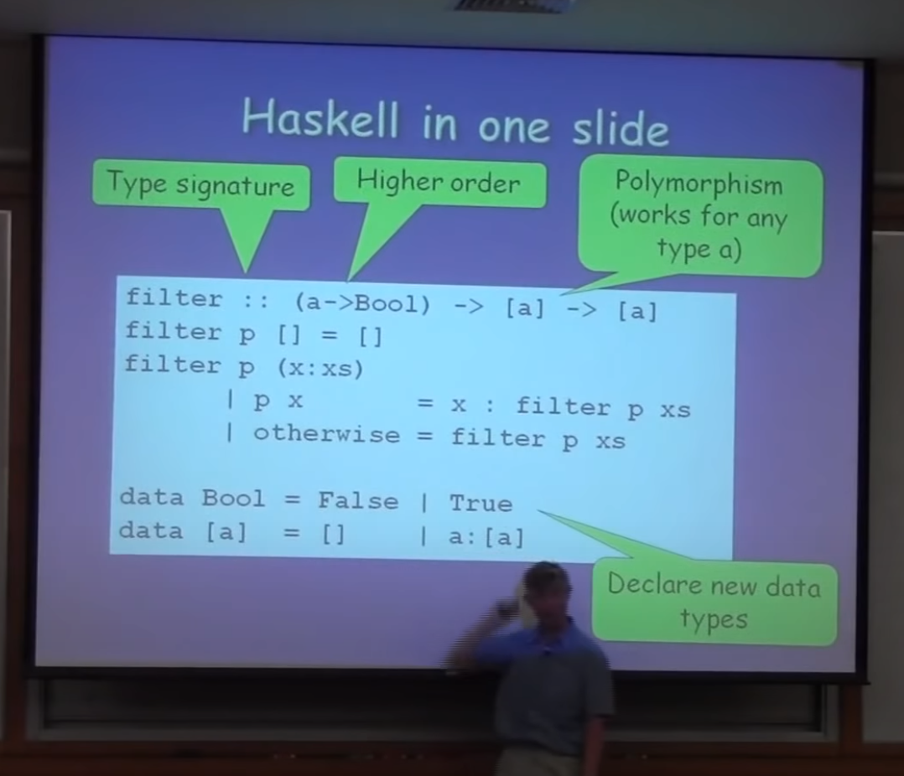
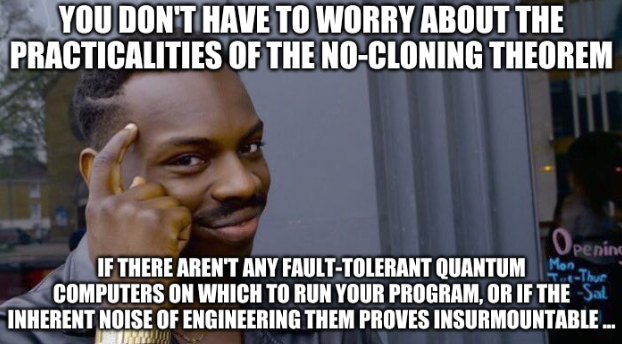

---
title: Linear Types in Haskell
author: Noon van der Silk ~ noonsilk@gmail.com
patat:
  images:
    backend: w3m
    path: /usr/lib/w3m/w3mimgdisplay
  pandocExtensions:
    - patat_extensions
    - emoji
  wrap: true
  incrementalLists: true
  theme:
    codeBlock: [onDullWhite]
    code:      [onDullWhite]
  margins:
    left: 1
    right: 1
...

# Hello!

# Plan!

1. Haskell in one slide!
2. What are linear types?
3. Examples in Haskell
4. Linear Base
5. A "practical" example


# 




# 2. What are linear types?!

- Simply: A way to specify that a variable should be used, under certain
conditions

    - Motivation (from the paper):

        1. Enforce usage requirements (files, sockets, ...?)

        2. Safe/optimised implementations of mutable datastructures

- Let's look at some code ...

- Consider:
  ```
  f :: Int -> Int
  f x = ...
  ```

- Maybe we'd like to make sure (at compile time) that this function _uses_ the
`x` variable.

- Up until recently, in Haskell, this can't be expressed via the type system.

- But now it can be! With the new language extension: `LinearTypes`.

- Let's take a look!


# 3. Examples in Haskell

## Example 1

- There's a new type operation `a %1-> b`.

- Example 1:

  ```haskell
  {-# LANGUAGE LinearTypes #-}

  import Prelude (Int)

  -- | Given a tuple, swap the elements!
  --
  -- example: linearSwap (2, 10) = (10, 2)
  --
  linearSwap :: (Int, Int) %1-> (Int, Int)
  linearSwap (x, y) = (x, x) -- Oh no!
  ```

- _~ Demo: Example1.hs  ~_

- We get two errors:

  ```
  /home/noon/dev/linear-types/src/Main.hs:14:13: error:
      • Couldn't match type ‘'Many’ with ‘'One’
          arising from multiplicity of ‘x’
      • In the pattern: (x, y)
        In an equation for ‘linearSwap’: linearSwap (x, y) = (x, x)
    |
  14 | linearSwap (x, y) = (x, x)
    |             ^

  /home/noon/dev/linear-types/src/Main.hs:14:16: error:
      • Couldn't match type ‘'Many’ with ‘'One’
          arising from multiplicity of ‘y’
      • In the pattern: (x, y)
        In an equation for ‘linearSwap’: linearSwap (x, y) = (x, x)
    |
  14 | linearSwap (x, y) = (x, x)
    |                ^
  ```

- Cool!


# 3. Examples in Haskell

## Example 2

- Something slightly more interesting ...

  ```haskell
  {-# LANGUAGE LinearTypes       #-}
  {-# LANGUAGE NoImplicitPrelude #-}

  import Data.Num.Linear

  f :: Num a => a 1%-> a
  f x = x + x
  ```

- _~ Demo: Example2.hs  ~_

- We see the error:

  ```
  • Couldn't match type ‘'Many’ with ‘'One’
      arising from multiplicity of ‘x’
  • In an equation for ‘f’: f x = x + x
  ```

- That's great!

- Actually, there's a bit more happening here ...
    - Where did `+` come from?
    - And `Num` for that matter?!
    - They come from `linear-base` ...
    - _~ Let's take a look ~_


# 4. Linear Base

- Need linearised versions of common functions

- File IO, Monads, other things ...


# 5. A "practical" example

- Quantum computing (linear algebra!)...

    - Let `|φ> = |0> = [1, 0]`, then, consider the quantum "not" operation:

    ```
    X|φ> = |1> = [0, 1]
    ```

    - ( if X is the matrix [[0,1],[1,0]] )
  
    - I.e. we can have quantum variables, and apply quantum operations on
    them! Okay ...

    - One key issue - **The no-cloning theorem** - it says there is no way to copy a
    quantum variable.

    - Now, I know what you're thinking ...

#




# Quantum computing implementations

- Almost all programming-language versions of this are done via side-effects

- Example

    ```python
    # Example from `qiskit`, a Python library
    from qiskit import QuantumCircuit

    circ = QuantumCircuit(2, 2)
    circ.h(0)
    circ.cx(0, 1)
    circ.measure([0,1], [0,1])
    ```

    - ( Ironically, Einstein famously hates stateful programming ... )

- One could imagine an implementation in a language with linear types that
enables programming more explicitly:

    ```haskell
    -- See: ./src/Quantum.hs for full code

    -- One quantum variable
    data Qubit

    h :: Qubit %1-> Qubit
    cx ::   Qubit 
       %1-> Qubit 
       %1-> (Qubit, Qubit)

    algorithm ::   (Qubit, Qubit)
              %1-> (Qubit, Qubit)
    algorithm (s0, s1) = cx (h s0) s0
    ```

    - Maybe this is better??

    - _~ Demo: Quantum.hs  ~_


# References

- The Linear Haskell paper: <https://arxiv.org/pdf/1710.09756.pdf>
- The GHC proposal: <https://ghc.gitlab.haskell.org/ghc/doc/users_guide/exts/linear_types.html>
- The `linear-base` library: <https://github.com/tweag/linear-base>
- The Proto-Quipper-D language/paper:
    - <https://arxiv.org/pdf/2005.08396.pdf>
    - <https://gitlab.com/frank-peng-fu/dpq-remake>
- *~ Thanks! ~*

- I'm new to Cambridge; keen to meet people, so please reach out and say hello!

